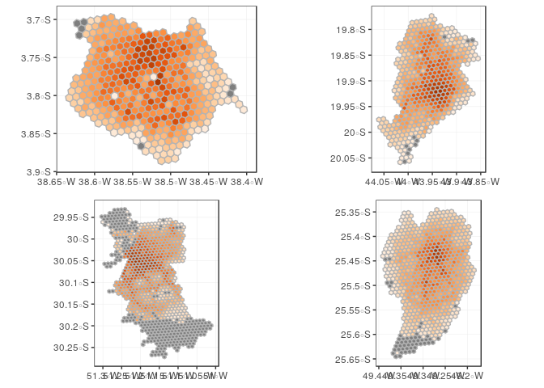

Matriz de tempo
================
Ipea
27 de março de 2019

# Matriz de tempo de viagem

Foram desenvolvidos dois métodos para fazer consultas ao OTP e retornar
uma matriz de tempo de viagem:

  - Função `matriz_acessibilidade`, desenvolvida nesse projeto, que faz
    consultas em paralelo ao `router` do OTP (`localhost`) (em R);
  - Método em python (repo
    [aqui](https://github.com/rafapereirabr/otp-travel-time-matrix)),
    desenvolvida pelo [Rafael
    Pereira](https://github.com/rafapereirabr), que faz uso da interação
    entre Java e Python para fazer consultas ao OTP e retornar uma
    matriz de tempo de viagem.

## Benchmark

Buscando escolher o método de melhor performance para o projeto, é feito
um benchmark das alternativas. Para tanto, será utilizada uma amostra de
100 pontos da cidade de Fortaleza para avaliar qual dos dois método é
melhor.

A função `matriz_acessibilidade` tem somente um argumento obrigatório,
que é a cidade em questão. Além disso, é usado o argumento `amostra`,
que utilizará somente 100 pontos para a construção da matriz de tempo.

``` r
# ligar_servidor("fortaleza")

bench_r <- system.time(matriz_acessibilidade("fortaleza", ligar_otp = TRUE, amostra = TRUE))
```

Usando python:

``` r
source("R/sfc_as_cols.R")

for_hex <- read_rds("../data/hex_municipio/hex_for.rds") %>%
  select(id_hex) %>%
  # Gerar somente 100 pontos
  # slice(1:100) %>%
  identity()

for_hex_centroids <- for_hex %>%
  st_centroid() %>%
  sfc_as_cols(names = c("X","Y")) %>%
  rename(GEOID = id_hex)

# salvar

write_csv(for_hex_centroids, "../otp/points/points_for.csv")
```

Agora rodando o comando para criar a matriz de tempo de viagem em
python:

``` r
setwd("../otp")

command <- "java -jar programs/jython.jar -Dpython.path=programs/otp.jar  py/python_script_for.py"

bench_py <- system.time(system(command))

system(command)

# para todos pontos: Elapsed time was 277.288 seconds
```

<!-- Resultado: o método em python levou cerca de 8 minutos enquanto que o método em python levou 4,5 minutos. -->

## Metodologia para a construção da matriz

Atestado que o método por python é mais veloz, é estabelecido então o
método para a construção das matrizes de tempo de viagem usando o
script em Python. O processo é dividido em três etapas: criação dos
pontos de origem e destino, criação do script em python e aplicação do
comando para iniciar o OTP.

### Criar pontos de origem para todas as cidades

É criada então uma função que gera os pontos de origem e destino e suas
coordenadas (no formato requerido pelo OTP e script em Python), para
cada uma das resoluções de hexágonos determinadas anteriormente. A
partir do nome abreviado do município (`CIDADE`), a função extrai o
centróide de cada hexágono para todas as resoluções (`RES`) e salva no
disco o nome `points_CIDADE_RES.csv` na pasta `../otp/points`.

``` r
points_allres <- function(muni_shortname) {
  
  dir <- dir("../data/hex_municipio/", pattern = muni_shortname)
  
  res <- str_extract(dir, "\\d+")
  
  dir_muni <- paste0("../data/hex_municipio/hex_", muni_shortname, "_", res, ".rds")
  
  seila <- function(muni_res) {
    
    dir_muni <- muni_res
    
    res <- str_extract(dir_muni, "\\d+")
    
    # criar pontos
    hex_muni <- readRDS(dir_muni) %>%
      select(id_hex) %>%
      st_centroid() %>%
      sfc_as_cols(names = c("X","Y"))
    # rename(GEOID = id_hex)
    
    
    # salvar
    dir_output <- sprintf("../otp/points/points_%s_%s.csv", muni_shortname, res)
    
    write_csv(hex_muni, dir_output)
    
  }
  
  walk(dir_muni, seila)
  
}
```

``` r
# criar pontos
points_allres("for")
# criar pontos
points_allres("bel")
# criar pontos
points_allres("rio")
# criar pontos
points_allres("cur")
# criar pontos
points_allres("por")
# criar pontos
points_allres("sao")
```

### Criar script em Python

A função `criar_script_python` cria um script em python na pasta
`../otp/py` que é utilizado para gerar os tempos de viagem entre os
pares OD, e precisa de três inputs:

  - `municipio`: é a sigla do município desejado (três primeiras
    letras);
  - `data`: é a data de análise. Essa data deve estar dentro do
    intervalo `start_date`e `end_date` de datas determinado no arquivo
    `calendar.txt` que está no GTFS que foi utilizado para construção do
    graph daquela cidade (AGORA É POSSÍVEL SELECIONAR A DATA
    AUTOMATICAMENTE ATRAVÉS DA FUNÇÃO `selecionar_data_gtfs`);
  - `res`: é a resolução de hexágonos desejada.

O formato final do script é `otp_CIDADE_DATA_RES.py`.

### Aplicar comando para rodar OTP

Por fim, é necessário criar o comando para aplicar o OTP com o script em
python. A função `rodar_otp` monta o comando a ser encaminhado para o
Prompt de Comando, e toma como input a cidade, a data e a resolução
desejada.

``` r
aplicar_otp <- function(cidade, data, res = "08", all_modes = TRUE) {
  
  if (all_modes == FALSE) {
    
    py_nome <- sprintf("otp_%s_%s_%s.py", cidade, data, res) }
  
  else {
    
    py_nome <- sprintf("otp_%s_%s_%s_paral_allmodes.py", cidade, data, res)
    
  }
  
  comando <- sprintf("cd ../otp && java -jar programs/jython.jar -Dpython.path=programs/otp.jar py/%s", py_nome)
  
  shell(comando)
  
}
```

## Matriz de tempo de viagem

Por fim, para a construção da matriz de tempo de viagem, as três etapas
da metodologia descritas acima são aplicadas. Primeiro são criados todos
os pontos centróides dos hexágonos (para todas as resoluções), depois é
criado o script em python, e por fim é rodado o OTP.

### Matriz para Fortaleza

Para Fortaleza:

``` r
# Selecionar o dia
dia <- selecionar_data_gtfs("for")

# criar arquivo python
criar_script_python("for", dia, "08")

# Criar arquivo em python em paralelo, entre 7 e 9 da manha, e para todos os modos
criar_script_python_paral_modes("for", data = dia, res = "08", from = 7, until = 9, every = 30)

# aplicar otp para todos os modos
aplicar_otp("for", data = dia, res = "08", all_modes = TRUE)

# Elapsed time was 362.011 seconds
```

Para a resolução 8, para todos os modos, e com partida a cada meia hora
entre 7h e 9h, o tempo total foi de 362 segundos.

Para a resolução 9:

``` r
# Selecionar o dia
dia <- selecionar_data_gtfs("for")

# criar arquivo python
criar_script_python("for", dia, "09")

# Criar arquivo em python em paralelo, entre 7 e 9 da manha, e para todos os modos
criar_script_python_paral_modes("for", data = dia, res = "09", from = 7, until = 8, every = 30)

# aplicar otp para todos os modos
aplicar_otp("for", data = dia, res = "09", all_modes = TRUE)

# Elapsed time was 3113.68 seconds
```

### Matriz para Belo Horizonte

Aplicando o método em python para Belo Horizonte:

``` r
# Selecionar o dia
dia <- selecionar_data_gtfs("bel")

# criar arquivo python
criar_script_python("bel", dia, "08")

# Criar arquivo em python em paralelo, entre 7 e 9 da manha, e para todos os modos
criar_script_python_paral_modes("bel", data = dia, res = "08", from = 7, until = 9, every = 30)

# aplicar otp para todos os modos
aplicar_otp("bel", data = dia, res = "08", all_modes = TRUE)

# Elapsed time was 777.629 seconds
```

Para a resolução 8, para todos os modos, e com partida a cada meia hora
entre 7h e 9h, o tempo total foi de 777 segundos.

### Matriz para o Rio de Janeiro

Aplicando para o Rio de Janeiro:

``` r
# Selecionar o dia
dia <- selecionar_data_gtfs("rio")

# criar arquivo python
criar_script_python("rio", dia, "08")

# Criar arquivo em python em paralelo, entre 7 e 9 da manha, e para todos os modos
criar_script_python_paral_modes("rio", data = dia, res = "08", from = 7, until = 9, every = 30)

# aplicar otp para todos os modos
aplicar_otp("rio", data = dia, res = "08", all_modes = TRUE)

# Elapsed time was 777.629 seconds
```

Para a resolução 8, para todos os modos, e com partida a cada meia hora
entre 7h e 9h, o tempo total foi de 777 segundos.

### Matriz para Curitiba

Para Curitiba:

``` r
# Selecionar o dia
dia <- selecionar_data_gtfs("cur")

# criar arquivo python
criar_script_python("cur", dia, "08")

# Criar arquivo em python em paralelo, entre 7 e 9 da manha, a cada 30 minutos, e para todos os modos
criar_script_python_paral_modes("cur", data = dia, res = "08", from = 7, until = 9, every = 30)

# aplicar otp
aplicar_otp("cur", dia, "08", all_modes = TRUE)

# Elapsed time was 407.342 seconds
```

Para a resolução 8, para todos os modos, e com partida a cada meia hora
entre 7h e 9h, o tempo total foi de 407 segundos.

### Matriz para Porto Alegre

Para Porto Alegre:

``` r
# Selecionar o dia
dia <- selecionar_data_gtfs("por")

# criar arquivo python
criar_script_python("por", dia, "08")

# Criar arquivo em python em paralelo, entre 7 e 9 da manha, a cada 30 minutos, e para todos os modos
criar_script_python_paral_modes("por", data = dia, res = "08", from = 7, until = 9, every = 30)

# aplicar otp
aplicar_otp("por", dia, "08", all_modes = TRUE)

# Elapsed time was 584.123 seconds
```

Para a resolução 8, para todos os modos, e com partida a cada meia hora
entre 7h e 9h, o tempo total foi de 584 segundos.

### Matriz para São Paulo

O dia de análise para São Paulo terá que ser selecionado manualmente,
porque o graph da cidade é construído em cima de dois arquivos GTFS (um
da SPTrans e outro da EMTU).

Para São Paulo:

``` r
# Selecionar o dia
dia <- "2019-05-15"

# criar arquivo python
criar_script_python("sao", dia, "08")

# Criar arquivo em python em paralelo, entre 7 e 9 da manha, a cada 30 minutos, e para todos os modos
criar_script_python_paral_modes("sao", data = dia, res = "08", from = 7, until = 9, every = 30)

# aplicar otp
aplicar_otp("sao", dia, "08", all_modes = TRUE)

# 
```

## Avaliar qualidade dos resultados

A avaliação da qualidade dos resultados retornados pelo OTP consiste na
checagem se todos os pontos de origem e destino foram analisados
corretamente.

``` r
# cidade <- "por"

avaliar_qualidade_otp <- function(cidade) {
  
  pattern_cidade_pt <- sprintf("ttmatrix_%s_pt_08_.*.csv$", cidade)
  pattern_cidade_ative <- sprintf("ttmatrix_%s_(walk|bike)_08.csv$", cidade)
  
  files_cidade_pt <- dir("../data/output_ttmatrix", full.names = TRUE, pattern = pattern_cidade_pt)
  files_cidade_ative <- dir("../data/output_ttmatrix", full.names = TRUE, pattern = pattern_cidade_ative)
  
  otp_matrix_pt <- map_dfr(files_cidade_pt, fread)
    
  # abrir os pontos
  points_file <- sprintf("../otp/points/points_%s_08.csv", cidade)
  points <- read_csv(points_file)
  
  # checar os pontos na matrix
  origem_matrix_pt <- unique(otp_matrix_pt$origin)
  destino_matrix_pt <- unique(otp_matrix_pt$destination)
  
  # quais pontos ficaram fora?
  origem_fora <- setdiff(points$id_hex, origem_matrix_pt)
  destino_fora <- setdiff(points$id_hex, destino_matrix_pt)
  
  fim <- data.frame(cidade = cidade, origem_fora = origem_fora, destino_fora = destino_fora) %>%
    select(cidade, origem_fora)
  
  # SOON
  # fim_spatial <- 
    
  fim_agreg <- data.frame(cidade = cidade, origem_fora = origem_fora, destino_fora = destino_fora) %>%
    count(cidade) %>%
    mutate(Percentual = n/nrow(points)) %>%
    mutate(Percentual = scales::percent(Percentual))
  
  
}

# Aplicar funcao
qualidade_otp <- map_dfr(c("for", "bel", "cur", "por"), avaliar_qualidade_otp)


# # visualilzar os pontos que ficaram fora
# 
# # pontos de origem
# points %>%
#   dplyr::filter(id_hex %in% fim$origem_fora) %>%
#   st_as_sf(coords = c("X", "Y"), crs = 4326) %>%
#   mapview()
```

Por enquanto a função é aplicada para quatro cidades: Fortaleza, Belo
Horizonte, Curitiba e Porto Alegre. O `Percentual` representa o
percentual de pontos que não foi roteado pelo OTP em relação ao total de
pontos daquela cidade.

``` r
qualidade_otp %>%
  mutate(Cidade = c("Fortaleza", "Belo Horizonte", "Curitiba", "Porto Alegre")) %>%
  # mutate(Percentual = color_bar("red")(Percentual)) %>%
  select(Cidade, n, Percentual) %>%
  kable() %>%
  # column_spec(3, width = "3cm") %>%
  kable_styling(bootstrap_options = "striped", full_width = F)
```

<table class="table table-striped" style="width: auto !important; margin-left: auto; margin-right: auto;">

<thead>

<tr>

<th style="text-align:left;">

Cidade

</th>

<th style="text-align:right;">

n

</th>

<th style="text-align:left;">

Percentual

</th>

</tr>

</thead>

<tbody>

<tr>

<td style="text-align:left;">

Fortaleza

</td>

<td style="text-align:right;">

7

</td>

<td style="text-align:left;">

1.79%

</td>

</tr>

<tr>

<td style="text-align:left;">

Belo Horizonte

</td>

<td style="text-align:right;">

10

</td>

<td style="text-align:left;">

2.14%

</td>

</tr>

<tr>

<td style="text-align:left;">

Curitiba

</td>

<td style="text-align:right;">

51

</td>

<td style="text-align:left;">

7.61%

</td>

</tr>

<tr>

<td style="text-align:left;">

Porto Alegre

</td>

<td style="text-align:right;">

298

</td>

<td style="text-align:left;">

33.9%

</td>

</tr>

</tbody>

</table>

Próxima pergunta: onde estão esses pontos?

Avaliar a qualidade do indicador de acessibilidade:

``` r
# cidade <- "bel"

avaliar_qualidade_acess <- function(cidade) {
  
  pattern_cidade_pt <- sprintf("ttmatrix_%s_pt_08_.*.csv$", cidade)
  pattern_cidade_ative <- sprintf("ttmatrix_%s_(walk|bike)_08.csv$", cidade)
  
  files_cidade_pt <- dir("../data/output_ttmatrix", full.names = TRUE, pattern = pattern_cidade_pt)
  files_cidade_ative <- dir("../data/output_ttmatrix", full.names = TRUE, pattern = pattern_cidade_ative)
  
  otp_matrix_pt <- map_dfr(files_cidade_pt, fread)
  
  # abrir oportunidades com hexagonos
  dir_hex <- sprintf("../data/hex_agregados/hex_agregado_%s_%s.rds", cidade, "08")
  hexagonos_for_sf <- read_rds(dir_hex) %>%
    select(id_hex) %>%
    ungroup()
  
  matriz_for <- otp_matrix_pt %>%
    left_join(hexagonos_for_sf, by = c("origin" = "id_hex")) %>%
    select(origin, destination, travel_time) %>%
    mutate(travel_time = travel_time/60) %>%
    mutate(empregos = 1) %>%
    dplyr::filter(travel_time < 60) %>%
    group_by(origin) %>%
    summarise(empregos = sum(empregos))
  
  access_ac_for_fim <- hexagonos_for_sf %>%
    select(id_hex) %>%
    left_join(matriz_for, by = c("id_hex" = "origin"))
  
  
  access_ac_for_fim %>%
    ggplot() +
    geom_sf(aes(fill=empregos), color="gray70") +
    scale_fill_distiller( palette="Oranges", guide = "colorbar", name="Jobs\nDensity", direction = 1) +
    theme_bw() +
    theme(legend.position = "none")
  
  # mapview(access_ac_for_fim, zcol = "empregos")
  
}

avaliar_qualidade_acess("for") +
avaliar_qualidade_acess("bel") +
avaliar_qualidade_acess("por") +
avaliar_qualidade_acess("cur") +
  plot_layout(ncol = 2)
```

<!-- -->
