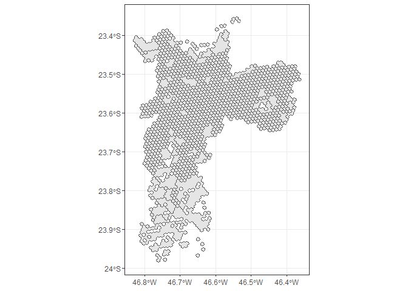
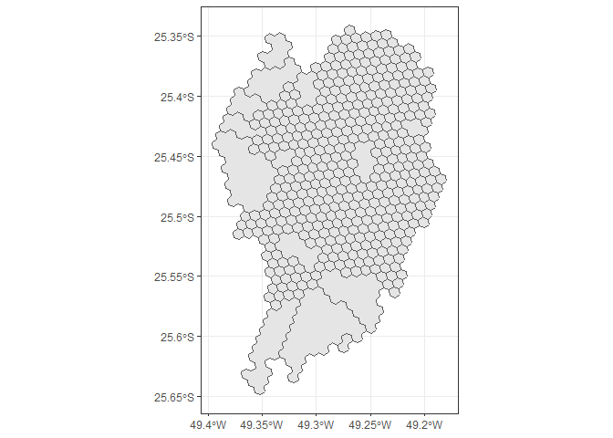

Agregação de áreas de baixa densidade
================
Ipea
9 de maio de 2019

Re-Agregação de áreas de baixa densidade
========================================

Buscando diminuir a quantidade de pares OD de análise, foi feita uma tentativa de agregação de áreas de baixa densidade das zonas urbanas.

Método
------

Para reagregar os hexágonos em áreas de baixa densidade, foram utilizadas as UDHs de cada cidade. Analisando a distribuição da densidade população de cada cidade (pelas UDHs), foi definido a densidade do 10º percentil da distribuição como a densidade máxima: toda UDH com densidade abaixo desta está sujeita a reagregação.

Dessa forma, para cada UDH sujeita a reagregação, foram filtrados os hexágonos que estavam presentes nessas UDHs. Os hexágonos, então, foram agregados, levando consigo a soma da população, empregos, estabelecimentos de saúde e educação.

Aplicação
---------

``` r
source("analysis/teste_agregar_low_density_udh.R")
```

No momento duas cidades foram sujeitas a reagregação: São Paulo e Curitiba.

``` r
# APLICAR -----------------------------------------------------------------

# Sao Paulo
novo_sao <- extract_lowdensity_areas("sao")
```

    ## Reading layer `RM_SaoPaulo_UDH_region' from data source `L:\Proj_acess_oport\data-raw\udh\sao\RM_SaoPaulo_UDH_region.shp' using driver `ESRI Shapefile'
    ## Simple feature collection with 2858 features and 4 fields
    ## geometry type:  MULTIPOLYGON
    ## dimension:      XY
    ## bbox:           xmin: -47.20852 ymin: -24.06425 xmax: -45.69481 ymax: -23.18342
    ## epsg (SRID):    4326
    ## proj4string:    +proj=longlat +datum=WGS84 +no_defs

``` r
# mapview(novo_sao)

novo_sao %>%
  ggplot()+
  geom_sf()+
  theme_bw()
```



``` r
# Curitiba
novo_cur <- extract_lowdensity_areas("cur")
```

    ## Reading layer `RM_Curitiba_UDH_region' from data source `L:\Proj_acess_oport\data-raw\udh\cur\RM_Curitiba_UDH_region.shp' using driver `ESRI Shapefile'
    ## Simple feature collection with 333 features and 4 fields
    ## geometry type:  MULTIPOLYGON
    ## dimension:      XY
    ## bbox:           xmin: -50.23152 ymin: -26.23735 xmax: -48.49931 ymax: -24.40189
    ## epsg (SRID):    4326
    ## proj4string:    +proj=longlat +datum=WGS84 +no_defs

``` r
# mapview(novo_cur)

novo_cur %>%
  ggplot()+
  geom_sf()+
  theme_bw()
```



Por fim, a tabela abaixo mostra a quantidade de hexagonos antes e depois da reagregação:

``` r
antes_sao <- nrow(read_rds("../data/hex_agregados/hex_agregado_sao_08.rds"))
antes_cur <- nrow(read_rds("../data/hex_agregados/hex_agregado_cur_08.rds"))
depois_sao <- nrow(novo_sao)
depois_cur <- nrow(novo_cur)

df <- data.frame(
  Cidade = c("São Paulo", "Curitiba"),
  Antes = c(antes_sao, antes_cur),
  Depois = c(depois_sao, depois_cur)
)

kable(df, format = "markdown")
```

| Cidade    |  Antes|  Depois|
|:----------|------:|-------:|
| São Paulo |   2186|    1203|
| Curitiba  |    670|     437|
